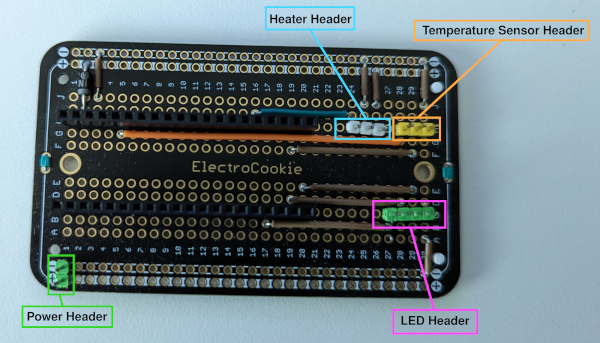
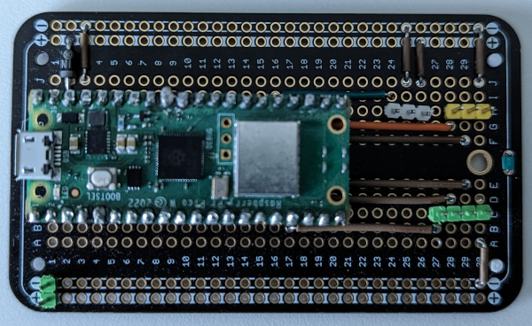
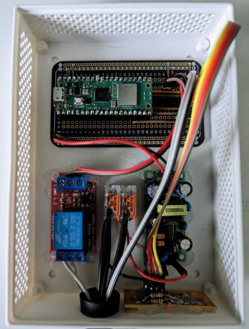
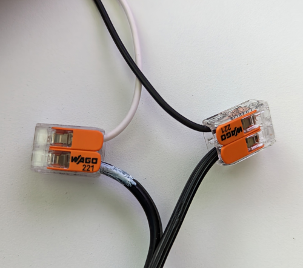

# Building the Filament Dryer

This project will make use of an existing dryer box. [This one](https://www.thingiverse.com/thing:2953325) is recommended, but
any dryer box that can support a heater and temperature sensor will work.

## Necessary Hardware

Once the dryer box is assembled, the following hardware is needed to assembly the controller:

* A [Raspberry Pi Pico W or WH](https://www.raspberrypi.com/products/raspberry-pi-pico/?variant=raspberry-pi-pico-w).
* A prototype PCB large enough to support the Pico.
  * The enclosure was designed around the [ElectroCookie Prototype PCB](https://www.amazon.com/dp/B07ZYNWJ1S).
* A 5V Relay capable of supporting the Heater.
  * The enclosure was designed around this [HiLetgo](https://www.amazon.com/dp/B00LW15A4W) relay.
* An AC-to-DC Power Module capable of providing 5V at 1A or greater.
  * The enclosure was designed around this [NOYITO](https://www.amazon.com/dp/B07C1XCH68) power module.
* A DHT-22/AM-2302 Temperature sensor.
  * [HiLetgo](https://www.amazon.com/dp/B0795F19W6) offers one already wired and ready to go.
* A heating pad for a terrarium or reptile enclosure.
  * This one from [BN-LINK](https://www.amazon.com/dp/B08C93ZGPJ) is a cheap and effective option.
* A desiccant for drying the air.
  * [Slice Engineering](https://www.amazon.com/dp/B09BVYYD7B) makes one specifically for filament.

Assembly will also require basic electrical components, such as wires, LEDs, resistors, diodes, header pins, solder, and
[splicing connectors](https://www.amazon.com/dp/B08W3QXN9B), as well as [grommets](https://www.amazon.com/dp/B09MT34X2B)
to help seal the holes drilled in the enclosure.

## Wiring and Assembly

Most of the components, such as the relay and power module, will be ready to go out of the box and need only be
dropped into the enclosure and wired to the Pico PCB. They can be set aside until the Pico PCB is ready.

### Setting up the Pico PCB

Although any PCB software can be used to create a custom PCB, the wiring here is simple enough that using a Prototyping
PCB is fairly straight forward. Simply solder on headers as shown below:

If using the default build options, the headers will be wired as shown in [this diagram](.assets/pcb.png). The setup
used here powers the Pico through VSYS, which requires a schottky diode (D1), a 1N5817 in the linked diagram, in order
to protect the system when using a USB to monitor or reprogram the device.

Once all the headers are soldered in place, the Pico PCB should look something like this:

It is possible to use a different setup if it is not possible to get a Pico WH or solder on headers, as long as the
connections match the provided wiring diagram (or whatever the build options specify).

### Enclosure

The enclosure comes in two pieces: The enclosure base and a lid. The STL files are available in the `stl` folder, and can
be imported into something like [Cura](https://ultimaker.com/software/ultimaker-cura/) or [Slic3r](https://slic3r.org/)
for use with 3D Printers.

It has been designed with the intention of not requiring supports to print, with a lid that allows easy access to the internal
components should anything need to be updated in the future. This is a filament dryer, so the goal of the lid is primarily
to prevent incidental contact with the internal parts.

The sensor and heater can come in through the large hole in the front of the enclosure, which can optionally be sealed with
a grommet if desired. There is also 3 small holes up front designed for 5mm LEDs, which by default are used to indicate when
the Heater is on/off, MQTT is connected, and the system is on.

Once the enclosure has been printed and the Pico PCB assembled, the components should all drop in:

#### Modifying the Enclosure

The CAD models for the enclosure are provided in the `cad` folder. They can be modified using [FreeCAD](https://www.freecad.org/).

### Connecting the Heater

Connecting the Heater only requires cutting off the AC plug it comes with and connecting it to the Power Relay using the
splicing connecters as shown below:

### Putting it all together
