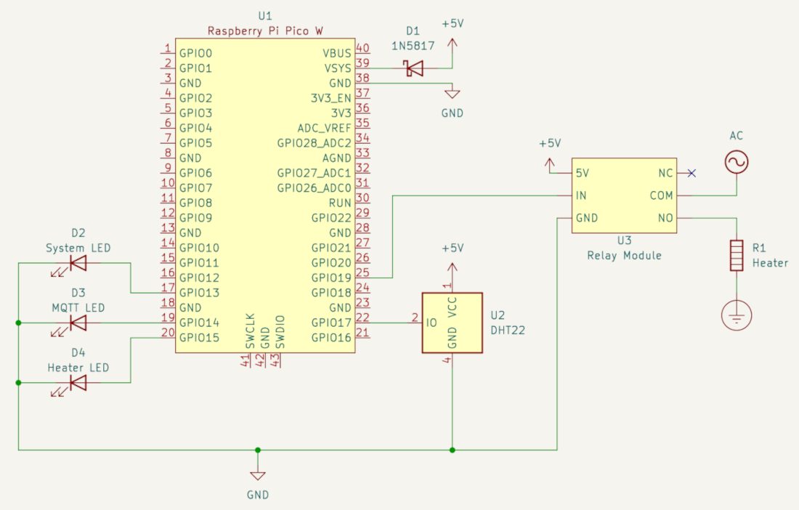

# Building the Filament Dryer

This project will make use of an existing dryer box. [This one](https://www.thingiverse.com/thing:2953325) is recommended, but
any dryer box that can support a heater and temperature sensor will work.

## Necessary Hardware

Once the dryer box is assembled, the following hardware is needed to assembly the controller:

* A [Raspberry Pi Pico W or WH](https://www.raspberrypi.com/products/raspberry-pi-pico/?variant=raspberry-pi-pico-w).
* A prototype PCB large enough to support the Pico.
  * The [ElectroCookie Prototype PCB](https://www.amazon.com/dp/B07ZYNWJ1S) is the one used in the sample project.
* A 5V Relay capable of supporting the Heater.
  * The sample project uses one from [HiLetgo](https://www.amazon.com/dp/B00LW15A4W).
* An AC-to-DC Power Module capable of providing 5V at 1A or greater.
  * The sample project uses one from [NOYITO](https://www.amazon.com/dp/B07C1XCH68).
* A DHT-22/AM-2302 Temperature sensor.
  * The sample project uses one from [HiLetgo](https://www.amazon.com/dp/B0795F19W6).
* A heating pad for a terrarium or reptile enclosure.
  * The sample project uses one from [BN-LINK](https://www.amazon.com/dp/B08C93ZGPJ).
* A desiccant for drying the air.
  * [Slice Engineering](https://www.amazon.com/dp/B09BVYYD7B) makes one specifically for filament.

Assembly will also require basic electrical components, such as wires, solder, and [splicing connectors](https://www.amazon.com/dp/B08W3QXN9B),
as well as [grommets](https://www.amazon.com/dp/B09MT34X2B) to help seal the holes drilled in the enclosure.

## Wiring Diagrams

## Enclosure

### Modifying the Enclosure

The CAD models for the enclosure are provided in the `cad` folder. They can be modified using [FreeCAD](https://www.freecad.org/).
